# Saeed Kolivand - Portfolio

## Read it: [iamsaeed.dev](https://iamsaeed.dev/)

[](https://iamsaeed.dev/)
[](https://github.com/saeedkolivand/saeed-kolivand-portfolio/actions/workflows/deploy.yml)
[](https://nextjs.org)

<p align="center">
  <a href="https://iamsaeed.dev/">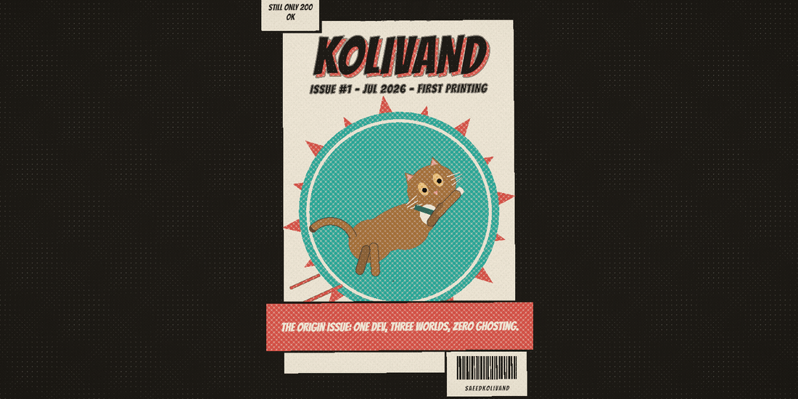</a>
</p>

<p align="center">
  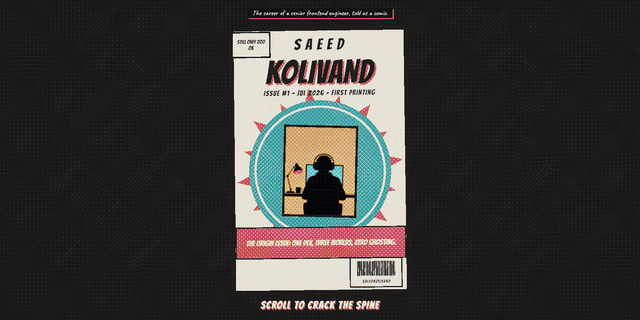
</p>

A scroll-driven portfolio built as a comic book. One global scroll position `t` in `[0,1]` drives twelve "issues" (scenes) inside a single React Three Fiber canvas, filmed by an authored shot list and printed through custom GLSL — halftone, ink line, crosshatch, paper. A fully designed static **Print Edition** renders instead for reduced-motion, narrow viewports, and no-WebGL.

The comic framing is not decoration; it is where the hard constraints come from. Comics are read at the reader's pace, in both directions, with no "playhead" — so the engine has to be a pure function of scroll position, deterministic, and identical frame-for-frame whichever way you arrived. Everything below follows from that.

[The constraints](#the-constraints) ·
[The twelve issues](#the-twelve-issues) ·
[Audio](#audio) ·
[Degradation ladder](#degradation-ladder) ·
[Print Edition](#accessibility-and-the-print-edition) ·
[Tech](#tech) ·
[Run it](#run-it) ·
[Deployment](#deployment) ·
[Engine notes](docs/ENGINE.md)

---

## The constraints

**1. Everything visible is `f(t)`.** You can scrub backwards through the entire run and get exactly the frames you saw on the way down. That is the whole design: `evaluateTimeline(t)` ([`lib/shots.ts`](lib/shots.ts)) is a binary search over a precompiled, gap-free segment list returning camera pose, shot progress and transition state for any `t` with zero frame history. Two things are deliberately outside it, and only two:

- **Authored-time beats** ([`lib/beats.ts`](lib/beats.ts)) fire when `t` crosses a trigger — idempotent by id (HMR/StrictMode safe), re-armed with hysteresis (default `0.006`) once `t` retreats, skipped entirely under reduced motion. Travel stays `f(t)`; only the slam is timed. The split is enforced: on the title drop, the card's *visibility* is a pure scroll window in [`components/Lettering.tsx`](components/Lettering.tsx), so an unfired beat (deep jump, reduced motion) still shows the card resting — the beat only owns the oversized impact frame.
- **The music clock** (below), which is wall-clock locked with `f(t)` layer gains.

**2. No `Math.random` on any scroll-driven path.** Every jitter, variant pick and noise draw is a seeded hash. [`lib/onomatopoeia.ts`](lib/onomatopoeia.ts) uses an FNV-style string hash after the `Math.random` default "burned two issues' scrub-determinism gates". [`lib/audio/util.ts`](lib/audio/util.ts) ships *two* hashes and documents why: the Knuth multiplicative hash is linear in `n`, so over consecutive indices it produces a sawtooth (autocorrelation 0.98 at lag 144) — fill an audio buffer with it and you get a near-ultrasonic whistle, not noise. Dense indices get a murmur3 avalanche mixer instead. The offline bake keeps the same rule from the other end: every generated asset is a pure function of a committed seed, so a re-render of an unchanged prompt reproduces the same audio.

**3. Rest frames must be bit-identical.** [`components/PostPipeline.tsx`](components/PostPipeline.tsx) snaps the asymptotically-decaying velocity to hard `0` below `1e-3`; [`components/ScrollProxy.tsx`](components/ScrollProxy.tsx) zeroes the store velocity after a 200 ms quiet window, because ScrollTrigger's `getVelocity` otherwise latches its last fling value forever at rest.

**4. Three flashes per rolling second, centrally.** [`lib/flashBudget.ts`](lib/flashBudget.ts) is twelve lines — a timestamp array capped at 3/second per WCAG 2.3.1. Every impact frame in the project is granted through it, enforced inside `registerJawDrop` ([`lib/beats.ts`](lib/beats.ts)) rather than trusted to each scene.

**5. One canvas, one composer, one pass.** Built once, never rebuilt; per-issue looks are uniform cross-fades.

---

## The twelve issues

[`issues/registry.ts`](issues/registry.ts) — ranges and gutters chain exactly to `1.000` ([`issues/timeline.ts`](issues/timeline.ts)).

| # | | Issue | `t` range | On the page |
|---|---|---|---|---|
| 0 |  | Cover | 0.000 – 0.030 | Four art layers, nearly coplanar, separating in z as the camera crash-dollies into the page |
| 1 | 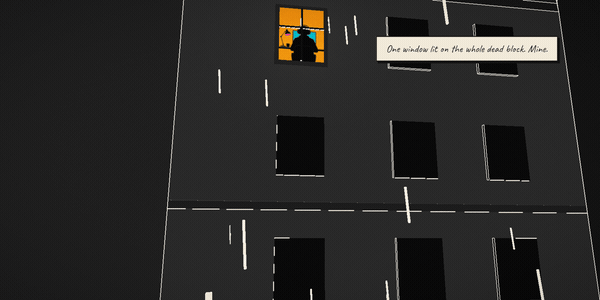 | Noir | 0.040 – 0.108 | Black-and-white hatched-ink street; instanced rain on stepped time; exactly one window prints in full color |
| 2 | 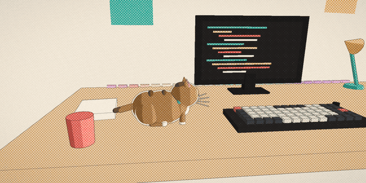 | Desk | 0.123 – 0.210 | Warm full-color halftone workspace, keys under the lamp, a live three-panel composite |
| 3 | 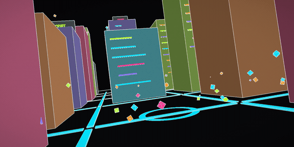 | Neon Ink | 0.225 – 0.305 | Black paper in flat neon inks — code-block buildings with syntax-highlighted facades, booting in a quantized cascade |
| 4 | 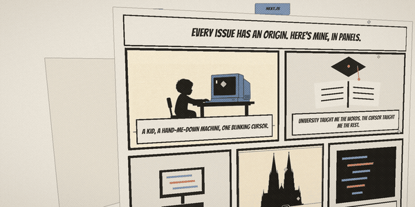 | Origin Page | 0.315 – 0.378 | One comic page in a paper void: seven story beats, kid to senior; the camera glides *through* the last panel |
| 5 | 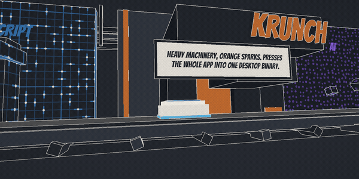 | The Press | 0.388 – 0.478 | A dark factory hall where the skills come off the conveyor, plate by plate |
| 6 | 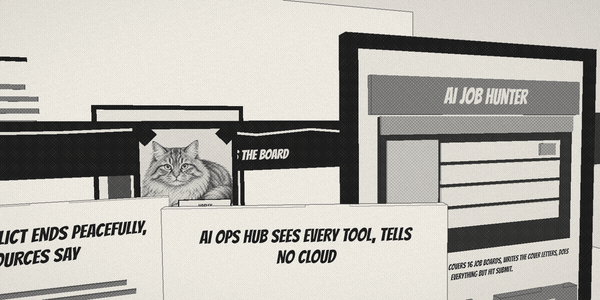 | Newsprint | 0.488 – 0.566 | You walk *inside* the front page: column rules underfoot, standing headline sheets, a commit-graph ticker |
| 7 | 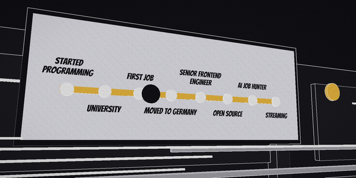 | Screentone | 0.576 – 0.656 | Manga screentone subway — one line crossing the page west to east, station by station |
| 8 | 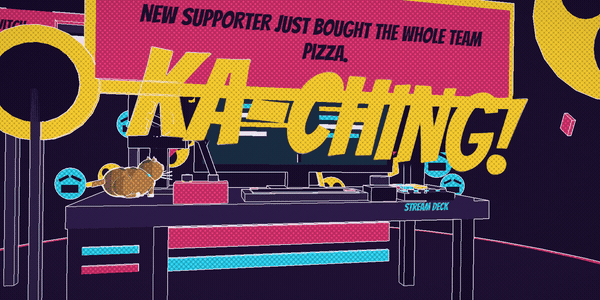 | Pop Print | 0.671 – 0.752 | Oversaturated webcomic streaming stage, live and on air |
| 9 | 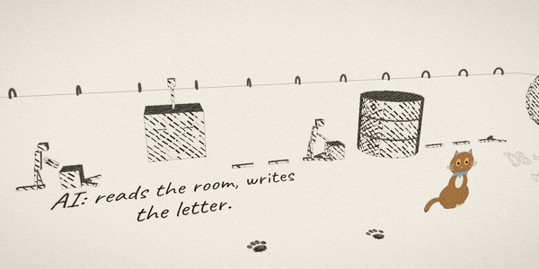 | Sketchbook | 0.762 – 0.838 | One sketchbook page lying flat: the architecture by hand, pencil to ink draw-on to wash flood |
| 10 | 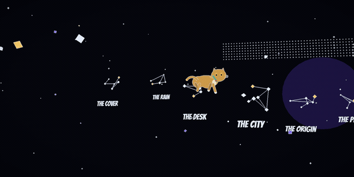 | The Spread | 0.848 – 0.930 | Near-black cosmos with the real GitHub contribution grid as a literal star chart, then the whole run unfolds as a double-page spread |
| 11 | 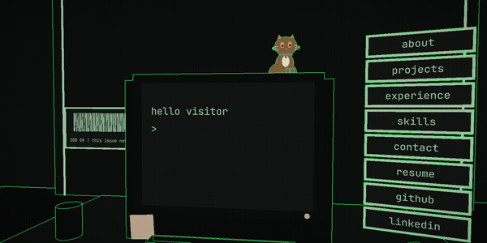 | Letters Page | 0.940 – 1.000 | The back cover: a CRT terminal that takes real keyboard input, plus clickable command cards |

There is a cat. Harley is a real, fluffy golden tabby, and she is the through-line — she walks you scene to scene and hides in every issue ([`components/CatModel.tsx`](components/CatModel.tsx)).

Each issue also declares an exit gutter and a beat-chart intensity that the score reads directly, and a new issue is one component file plus one row in the registry: [docs/ENGINE.md#gutters-and-intensity](docs/ENGINE.md#gutters-and-intensity).

---

## Audio

**This is a hybrid system, not pure synthesis.** The repo ships 36 committed `.m4a` files across six categories in `public/audio/` (`AUDIO_BYTES = 4388056` in [`lib/audio/manifest.ts`](lib/audio/manifest.ts)), and Tone.js 15 is still the runtime engine for everything else — ambience beds, scored gutter voices, the six-bus mix, and twelve convolution rooms rendered client-side from a parameter table, so zero impulse-response bytes ship.

Twelve slots ship as files and **every one of them is generated** — score, press slam, title drop, spread unfold, paper tear, page flip, cat, three room beds, terminal keys — each a Stable Audio 3 render from a committed prompt and seed ([`assets/audio-src/sfx.json`](assets/audio-src/sfx.json), [`assets/audio-src/score.json`](assets/audio-src/score.json)). The score alone is 68% of the payload.

The 120 s score is **wall-clock locked and gain-mixed, not scrubbed** ([`lib/audio/score.ts`](lib/audio/score.ts)): scrubbing music by scroll position sounds like a turntable, so the clock runs free and only gain and lowpass cutoff are `f(t, velocity)` — scrub-safe by construction. `hit()` returns `false` whenever a sample cannot play and every call site falls through to its synth voice, so a cold bank is inaudible rather than silent. Audio is **off by default and gesture-gated**.

Full detail — the trim rule that makes one-shots land on time, the hit-stop table, the bus graph, the metering-only pulse bus, and re-baking: [docs/ENGINE.md#audio](docs/ENGINE.md#audio).

---

## Degradation ladder

[`lib/device.ts`](lib/device.ts) is the single place that decides who gets 3D and at which tier. `ExperienceGate` is its only caller.

```text
fine pointer   ->  width >= 820
coarse pointer ->  min(innerWidth, innerHeight) >= 500  AND  innerWidth >= 700
```

Coarse devices split on the **short side**, not width: an iPhone 16 Pro Max is 956 CSS px wide in landscape, so a width test at 820 admits every current iPhone above the mini — at ~430 px of height and an aspect ratio where projected word-art area shrinks 0.74× against the desktop baseline, dropping blocks under the ink-exemption threshold. A phone's short side can never exceed its portrait width (440 at most); a tablet's clears 660 even after browser chrome. The 700 px width floor is there because the short side alone cuts through the iPad Split View pane range (507, 570, 678 px), all far narrower than these compositions were authored for. UA sniffing is not an option: iPadOS Safari defaults to "Request Desktop Website" and reports itself as macOS. `innerWidth/innerHeight` rather than `screen.*` specifically so Split View panes shrink.

Tablets run the full experience at the **low tier**, which is a real ladder rather than a label: dpr `[1,2] -> [1,1.5]`, stepped animation 12 -> 8 fps, reduced instance counts across [`issues/`](issues), halved audio voice partitions, and no music score.

`?low` forces the low tier **without** switching to Print — a flag that dumped you into the Print Edition could never be used to measure the tier it names.

---

## Accessibility and the Print Edition

The Print Edition ([`components/PrintEdition.tsx`](components/PrintEdition.tsx)) is a genuinely designed static comic, not a stub. It is **server-rendered on both paths** and stays in the accessibility tree behind the canvas rather than being hidden.

- One `<h1>` (the masthead), one `<h2>` per issue, a skip link, a labelled `<nav>`, real `<a>` links, `alt` on every image. All content is real DOM text — the same copy the 3D scenes letter.
- Focusing any link inside it while 3D is up tears the entire interactive stack down, so keyboard focus is never trapped under the canvas. The sound controls sit **before** it in DOM order precisely because anything after it would be unreachable by keyboard.
- Reduced motion means zero motion. [`components/PrintEdition.module.css`](components/PrintEdition.module.css) gates its only two animations (a 0.5 s root fade-in and a 2 px hover translate) behind `@media (prefers-reduced-motion: no-preference)`, so reduced-motion readers get a completely static page. Phone and no-WebGL readers who have not set the OS flag do see that small amount.
- Flash safety is enforced in code, not by convention: 3 flashes per rolling second, WCAG 2.3.1, granted centrally (see above).

The switch is two-way and preserves scroll position in both directions: [docs/ENGINE.md#the-print-edition-switch](docs/ENGINE.md#the-print-edition-switch).

---

## Tech

Next.js 16 (App Router, `output: "export"`) · React 19 · TypeScript 6 (strict) · React Three Fiber 9 + drei · `postprocessing` 6 · Three.js 0.185 with hand-written GLSL · Tone.js 15 (synthesis, sample playback, convolution) · GSAP + ScrollTrigger · Lenis · Zustand · Tailwind CSS 4.

Offline audio toolchain (not required to build or run): ffmpeg/ffprobe, ComfyUI + Stable Audio 3 Medium.

Fonts are loaded twice on purpose: `next/font/google` for DOM text, and self-hosted TTFs in `public/fonts/` for troika SDF lettering inside the canvas.

---

## Run it

```bash
npm install
npm run dev          # http://localhost:3000
```

| Script | What it does |
|---|---|
| `npm run dev` | Next dev server |
| `npm run build` | Runs `prebuild` ([`scripts/bake-contributions.mjs`](scripts/bake-contributions.mjs)) then `next build`; static export to `./out` |
| `npm run typecheck` | `tsc --noEmit` |
| `npm run bake:audio` | Re-bake `public/audio/` and regenerate `lib/audio/manifest.ts` (needs ffmpeg + ffprobe) |

**There are no tests and no linter.** The only checks are `npm run typecheck` and `next build`; CI runs the build.

Requires Node >= 20.9.

To see the Print Edition locally, enable your OS "reduce motion" setting or narrow the window below 820 px. `?low` forces the low quality tier without switching to print. `?debug` adds the perf HUD ([`components/PerfHUD.tsx`](components/PerfHUD.tsx)).

One caveat if you edit source: files under `app/`, `components/`, `lib/`, `issues/` and `shaders/` stay **pure ASCII**. A Turbopack bug on multi-byte characters in merged source maps kills the Next 16 build.

The plates and the GIF above were captured from the running app, not mocked up; the `t` positions and the ffmpeg commands are in [`docs/readme/CAPTURE.md`](docs/readme/CAPTURE.md).

> Open the browser console for a small easter egg.

---

## Deployment

GitHub Pages at the apex domain `iamsaeed.dev` via [`.github/workflows/deploy.yml`](.github/workflows/deploy.yml): `npm run build` produces a static `./out`, published on every push to `main`. `configure-pages` runs deliberately *without* `static_site_generator: next`, which would force a `basePath` meant for project subpaths and break every asset URL at a domain root.

No server and no third-party runtime fetches — the GitHub contribution grid is baked to `public/data/contributions.json` at build time over a pinned 365-day window, and falls back to a deterministic procedural starfield on any failure so the script can never fail the build. The page does fetch its own static audio assets, on demand, only after you enable sound.

---

## How it was built

Built with **Claude Code**: an orchestrator coordinating six specialised subagents — scene builder, shader engineer, gate auditor, performance profiler, docs researcher, content scribe. Their definitions are committed in [`.claude/agents/`](.claude/agents/).

---

<sub>© Saeed Kolivand. Style borrows the generic technique vocabulary of comic printing; no third-party characters, logos, or IP. Fonts are OFL (Bangers, Caveat, JetBrains Mono). The soundtrack is machine-generated with Stable Audio 3 Medium (Stability AI Community License); model, seed and generation parameters are committed at `assets/audio-src/score.json`. Harley is real and was not consulted.</sub>
